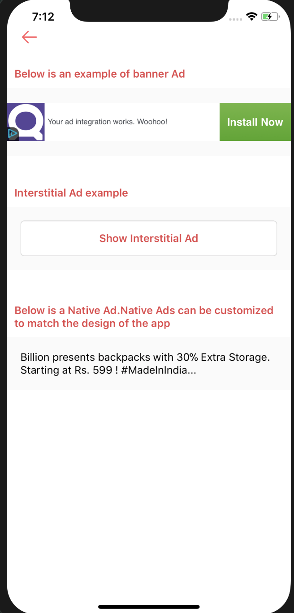

# Facebook Ads

There are 3 types of Facebook Ads :

1. Banner Ads - In place banners
2. Interstitial Ads - Opened in a modal and on top of App
3. Native Ads - Custom ads which can be created specific to the theme of the application. Facebook provides the data like title, description, cover image etc for Ad and you can use this data to create a custom ad.

Note - For facebook Ads to work, Please keep in mind that the app should meet the below requirements : 

1. You should have created a application on facebook developers [portal](https://developers.facebook.com).
2. Facebook Id, Scheme and Display Name should be updated in app.json.
3. You need to create placement Id for each ad you place in the app in the audience network [portal](https://business.facebook.com).

**For Sample Implementation, Check the container facebookAds under src/js/containers/facebookAds.**

**Detailed Reference Docs :**

1. 
2. 

